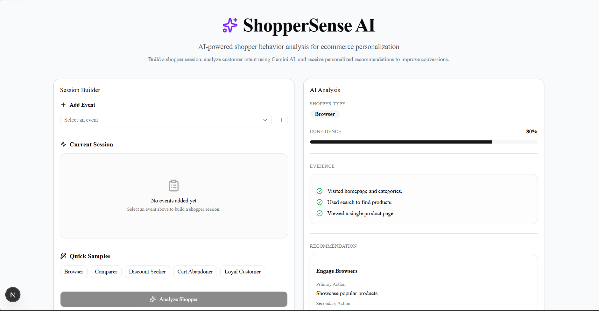

# 🛍️ ShopperSense AI

> **AI-powered Ecommerce Personalization Engine** built with **Next.js, NestJS, and Google Gemini** that analyzes shopper behavior, classifies customer intent, and generates personalized recommendations.

<p align="center">
  
</p>

---

## 🚀 Live Demo

- **Frontend:** https://helium-assignment-wine.vercel.app
- **Backend API:** https://helium-assignment-60i8.onrender.com

---

# 📖 Overview

ShopperSense AI is an AI-powered ecommerce personalization application that analyzes a shopper's browsing journey using Google Gemini.

Instead of relying on hardcoded business rules, the application leverages a Large Language Model (LLM) to understand shopper behavior from an event sequence and generates:

- Shopper Classification
- Confidence Score
- Supporting Evidence
- Personalized Recommendations

The application demonstrates how LLMs can be integrated into real-world ecommerce workflows while following a clean, production-ready architecture.

---

# ✨ Features

- 🤖 AI-powered shopper classification using Google Gemini
- 🧠 Prompt Engineering for behavioral reasoning
- 📊 Confidence score visualization
- 📝 AI-generated evidence for classification
- 💡 Personalized recommendation engine
- ⚡ Quick sample shopper journeys
- 🎨 Modern responsive UI
- ⏳ Skeleton loading experience
- 🛡️ Backend response validation
- 🧩 Clean modular architecture

---

# 🏗️ Architecture

```text
                Next.js Frontend
                       │
                       │ REST API
                       ▼
                 NestJS Backend
                       │
                Prompt Service
                       │
                       ▼
              Google Gemini API
                       │
                       ▼
           Structured JSON Response
                       │
                Parser & Validation
                       │
                       ▼
              Analysis Dashboard
```

---

# 🧠 AI Workflow

```text
Build Shopper Session
        │
        ▼
Generate Prompt
        │
        ▼
Google Gemini
        │
        ▼
Shopper Classification
        │
        ▼
Confidence + Evidence +
Recommendations
        │
        ▼
Display Analysis
```

---

# 🛠️ Tech Stack

## Frontend

- Next.js
- React
- TypeScript
- Tailwind CSS
- shadcn/ui
- Axios
- Lucide React

## Backend

- NestJS
- TypeScript
- Google Gemini API
- Class Validator
- Class Transformer

## AI

- Google Gemini 2.5 Flash
- Prompt Engineering
- Structured JSON Generation

## Deployment

- Vercel (Frontend)
- Render (Backend)

---

# 📂 Project Structure

```text
shopper-sense-ai/

├── client/
│   ├── app/
│   ├── components/
│   ├── constants/
│   ├── services/
│   ├── types/
│   └── public/
│
├── server/
│   ├── src/
│   │   ├── analysis/
│   │   ├── gemini/
│   │   ├── parser/
│   │   ├── prompt/
│   │   └── common/
│   └── .env
│
└── README.md
```

---

# 🧩 Shopper Types

The AI classifies shoppers into one of the following personas:

- Browser
- Comparer
- Discount Seeker
- Cart Abandoner
- Loyal Customer

---

# 📸 Sample Analysis

### Shopper Journey

```text
Homepage Visit
↓
Search Product
↓
View Product
↓
Add To Cart
↓
Checkout Started
↓
Purchase Completed
```

### AI Response

```text
Shopper Type:
Loyal Customer

Confidence:
92%

Evidence:
✔ Completed checkout
✔ Strong purchase intent
✔ Smooth buying journey

Recommendation:
Offer loyalty rewards
Recommend complementary products
```

---

# ⚙️ Environment Variables

## Backend (.env)

```env
GEMINI_API_KEY=your_google_gemini_api_key
```

## Frontend (.env.local)

```env
NEXT_PUBLIC_API_URL=http://localhost:3001
```

---

# 🚀 Running Locally

## Clone Repository

```bash
git clone https://github.com/your-username/shopper-sense-ai.git

cd shopper-sense-ai
```

---

## Backend

```bash
cd server

npm install

npm run start:dev
```

---

## Frontend

```bash
cd client

npm install

npm run dev
```

---

# 💡 Future Improvements

- Authentication
- Analysis History
- Real-time shopper event streaming
- Multi-session comparison
- Export reports (PDF/CSV)
- Multi-model AI support
- Analytics dashboard
- Confidence calibration

---

# 📚 Key Learnings

- Prompt Engineering for structured LLM outputs
- NestJS modular architecture
- Google Gemini API integration
- Response parsing and validation
- React state management
- Production-ready frontend architecture
- AI-powered user experience design

---

# 👨‍💻 Author

**Mohit Kumar**

Full Stack Developer | MERN | Next.js | NestJS | AI Applications

- GitHub: https://github.com/Mohit-kumar123
- LinkedIn: https://linkedin.com/in/your-linkedin-profile

---

## ⭐ If you found this project interesting, consider giving it a star!